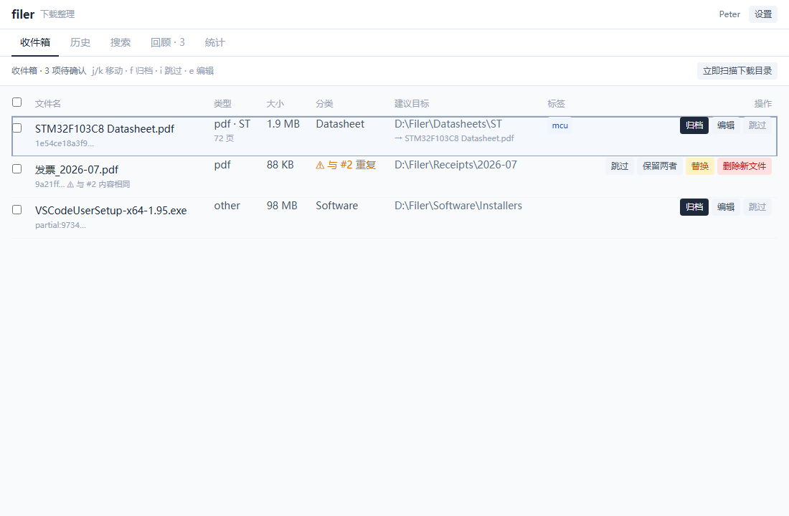
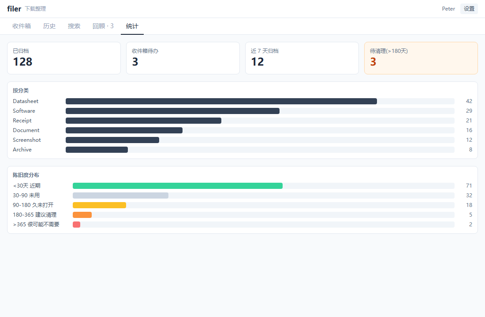

# filer


> 监控下载目录 → 自动分析预填建议元信息 → 整理分发到指定目录的特定文件夹。科学/规范/高效地组织下载内容。

filer 是一个本地下载内容整理小工具：它监控你指定的下载目录，文件下载完成后自动识别类型、建议分类/厂商/目标目录/规范化文件名，然后放进"收件箱"等你确认或编辑，确认后按规则移动（或复制）到结构化的归档目录树。所有索引存本地 SQLite，文件本身在本地目录间移动——不上云、不联网、不依赖任何外部服务。

## 截图

> 截图待补。把首启向导、收件箱（含重复下载 4 选项）、回顾 tab、统计仪表盘的截图放进 `screenshots/`，然后在此引用：
>
```




```


## 特性

- **自动监听**下载目录，识别下载完成（临时文件 `.part`/`.crdownload` 等忽略，size 稳定后入箱）。
- **自动分析**：文件类型（magic bytes + 扩展名）、PDF 页数/标题/厂商建议、图片尺寸、sha256 内容指纹。
- **规则引擎**：按扩展名/关键词/内容厂商匹配，算出分类 + 目标目录 + 规范化文件名。内置 datasheet / 发票 / 安装包 / 截图 / 文档 / 兜底 规则。
- **收件箱确认**：所有文件先进收件箱，逐条确认/编辑/跳过，不会误移。
- **可回滚**：每次归档记录原路径，支持撤销（移回原处）。
- **去重**：按 sha256 检测已归档的同内容文件，提示"已归档于 X"。
- **用户标签**：每条记录可挂自定义标签，用于归类与筛选。
- **时区可配**：模板日期目录按你选的时区生成，默认系统时区。
- **单二进制**：Tauri 2 (Rust) + React，无 sidecar、无 Python、无运行时依赖。

## 技术栈

Tauri 2 (Rust) + React 18 + Vite 8 + TypeScript 5.6 + Tailwind 3.4。SQLite（`rusqlite` bundled）做索引，`notify` 做文件监听，`lopdf` 提取 PDF 元数据，`image` 读图片尺寸。

## 开发

```bash
cd apps/filer/ui && npm install
cd ../src-tauri && cargo check
# 端到端开发运行：
cd ../ui && npm run tauri dev
```

## 许可证

MIT，见 [LICENSE](./LICENSE)。
